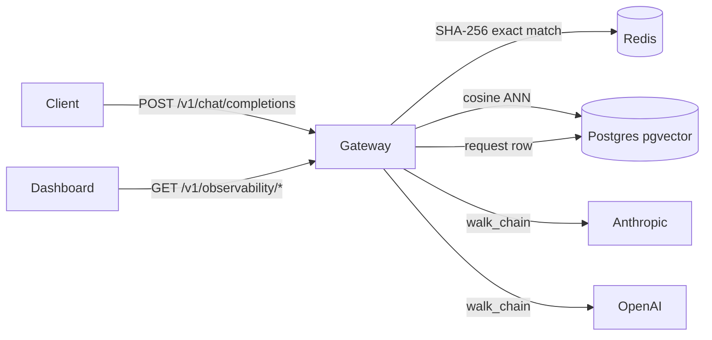

# The Conductor

The Conductor is an OpenAI-compatible transparent proxy that adds a two-layer cache, multi-provider failover, per-key budget enforcement, and a live observability dashboard to any stack already calling the OpenAI API.



---

## Quickstart

One changed line. Same SDK. Done. (Point `base_url` at your gateway — the self-host
command below brings one up on `localhost:8000`.)

```python
import openai
client = openai.OpenAI(base_url="http://localhost:8000/v1", api_key="dev-key")
print(client.chat.completions.create(model="gpt-4o-mini", messages=[{"role":"user","content":"hello"}]).choices[0].message.content)
```

---

## Architecture Decisions

These are the four decisions that shaped the design. Each one had a real alternative — the choice is the argument.

### ADR-001 — OpenAI-shape contract

**Decision:** Speak the OpenAI Chat Completions shape, not a custom API.

**Rejected:** A clean custom internal contract.

**Why:** Adoptability. Any SDK, LangChain instance, or LlamaIndex pipeline already works by changing one `base_url`. The coupling cost — a real translation layer per provider — is accepted and isolated behind a per-provider `Adapter` interface. A "universal" internal message format would be a third shape to maintain for two providers; the adapter pair is less code and the provider differences are mapped explicitly.

---

### ADR-002 — Cache after stream completion; failover only pre-first-token

**Decision:** Assemble and persist the cache entry once the stream closes. Fail over only before the first token is yielded.

**Rejected:** Mid-stream failover.

**Why:** Once the client has partial output it cannot cleanly retry elsewhere — continuing on a second provider produces a corrupt stream with a seam in the middle. The status peek in `_stream_attempt` runs inside `walk_chain` before any chunk is yielded; if the upstream returns 4xx/5xx, the chain cascades to the next candidate with no partial output sent. This constraint is honest and testable; pretending mid-stream failover is clean is not.

---

### ADR-003 — pgvector over a dedicated vector database

**Decision:** Semantic-cache vectors live in Postgres via the pgvector extension.

**Rejected:** A standalone vector database (Pinecone, Qdrant, Weaviate).

**Why:** One fewer piece of infrastructure. Postgres is already in the stack for the request log; gateway-cache scale does not need a specialized store. The HNSW cosine index in pgvector is fast enough for the access pattern (single ANN lookup per request, sub-millisecond on a warm index). Fewer moving parts beat marginal index-query performance at this scale.

---

### ADR-004 — FastAPI/Python over Go/Rust

**Decision:** Async FastAPI.

**Rejected:** Go or Rust for "infrastructure credibility."

**Why:** A clean, well-tested async implementation in the operated stack beats shaky code in a language the team does not operate. Gateway overhead is low single-digit milliseconds p50 — well within bounds for a proxy — see [Benchmark Results](#benchmark-results) for the current, reproducible figure. The hot path can be ported to Go later as a victory lap, not the build.

---

## Benchmark Results

**Final note:** the numbers below are the deployed-reference run — all four
benchmarks (overhead, throughput, cache, failover) measured **authenticated as
`bench-key`** directly on the live `conductor-demo` Fly instance
(`shared-cpu-1x`, 1 GiB RAM, region `sjc`, `GATEWAY_WORKERS=1`, Postgres=Neon,
Redis=Upstash, both reached over the public internet). Scripts were uploaded
via `fly ssh sftp` and run over SSH against the same already-running gateway
process real traffic hits — see [`bench/reports/bench-20260713-deployed-reference.md`](bench/reports/bench-20260713-deployed-reference.md)
for the full run config and per-benchmark source reports, and
`gateway/DEPLOY.md` to reproduce it yourself. The mocked-provider methodology
is unchanged (see `bench/README.md`) — only the hardware, network path, and
auth mode changed. The dev-laptop numbers from the first measurement round are
retained below for comparison; they are **not** the same run environment and
should not be read as "the gateway got slower" — see the notes under the table.

| Benchmark | Dev laptop (first measurement) | Deployed Fly instance, bench-key auth (final) |
|---|---|---|
| Overhead p50 | ~3.6 ms added over direct provider call | 483.3 ms added |
| Overhead p95 | ~8.0 ms added | 503.0 ms added |
| Overhead p99 | ~12.0 ms added | 634.8 ms added |
| Cache hit rate | 25.0% (50/200 exact hits under bench corpus) | 25.0% exact + 3.0% semantic (200-request corpus) |
| Cache hit vs miss latency | not measured in this round | p50 124.0 ms (hit) vs 457.5 ms (miss) |
| Failover success rate | 100% (200/200 when primary returns 503) | 100% (200/200); depth=1 latency p50 638.0 ms |
| Throughput peak | ~634 RPS, single worker, saturation at ~10 concurrent | 20.5 RPS mean, single worker, saturation at ~20 concurrent |

Reports: [`bench-20260713-175446-overhead.md`](bench/reports/bench-20260713-175446-overhead.md), [`bench-20260713-180139-throughput.md`](bench/reports/bench-20260713-180139-throughput.md), [`bench-20260713-cache.md`](bench/reports/bench-20260713-cache.md), [`bench-20260713-failover.md`](bench/reports/bench-20260713-failover.md) — or the consolidated [`bench-20260713-deployed-reference.md`](bench/reports/bench-20260713-deployed-reference.md).

**Why overhead and throughput look worse on Fly than on a dev laptop:** the
dev-laptop run had Postgres and Redis on loopback (sub-millisecond). The
deployed instance's Postgres (Neon) and Redis (Upstash) are managed services
reached over the public internet from a `sjc` VM — every request pays real
round-trip latency to both on the cache-check and request-log write paths,
which the local run couldn't see. This is an honest, structural cost of the
managed-services deployment topology, not a regression in the gateway's own
code — the mocked-provider methodology (isolating *added* latency from
provider latency) is identical in both runs. Reducing it would mean colocating
the gateway with its Postgres/Redis (e.g. Fly Postgres/Redis in the same
region), which is future work, not this deployment's goal.

**Why the Fly numbers above are also worse than an earlier same-day Fly run:**
an earlier round measured these same benchmarks on this instance **anonymously**
(no `Authorization` header) and got better numbers (overhead p50 ~216 ms, peak
RPS ~44, failover depth=1 p50 576 ms). Those numbers weren't wrong, but they
weren't honest about what a real API consumer experiences: none of the bench
scripts sent an `Authorization` header, so that run skipped the budget-check
round trip (`resolve_api_key` + `check_budget`/`record_spend`, hitting Neon and
Upstash over the public internet) that every authenticated request actually
pays. The numbers in the table above are from the `bench-key`-authenticated
re-run and supersede the anonymous ones as the reference figures.

**Cache hit rate and hit-vs-miss latency** are now measured directly on the
deployed instance for the first time. The original harness's
`cache_bench.py --mode=gateway` reset step called `redis.flushdb()` and an
unscoped `DELETE FROM semantic_cache` — safe against a disposable local stack,
but against the shared live instance it would have wiped real exact-cache
entries and, because budget counters live in the same Redis keyspace
(`budget:{api_key_id}:{YYYY-MM}`), reset `demo-key`'s and `bench-key`'s real
spend back to zero. The script was changed to reset non-destructively instead:
exact-cache Redis keys are deleted by their exact hash (only the keys this run
itself writes) and `semantic_cache` rows are deleted by `model = 'bench-cache'`
only — no `flushdb`, no unscoped `DELETE`. That made it safe to run live; see
`bench/cache_bench.py` and `bench/README.md` for the implementation.

**Sanity check:** every bench-key number above is worse than (or, for cache
hit rate, roughly consistent with) the earlier anonymous run — expected, since
auth adds a real budget-check round trip an anonymous request skips. The one
number that looks "good," cache hit latency being lower than miss latency, has
an obvious structural explanation (a hit skips the mock-provider round trip
entirely) rather than being a surprise, so nothing here was re-run. `bench-key`'s
own spend stayed at $0.0000 after the full run (bench models are seeded
without pricing, so `cost_cents` is always 0 for bench traffic).

**Methodology:** Cache bypassed for overhead and throughput benches (`cache: {no_cache: true}`). Failover ran against the deployed instance's default `FALLBACK_BACKOFF_BASE_MS=500` (production config, not the local `=0` speed setting), so the depth=1 latency above includes one real 500 ms backoff sleep per request — that's expected chain-walk behavior, not overhead. Semantic-similarity-threshold sweep (`--mode=similarity`) is a measurement of embedding-model quality, not hardware, so the existing report stands unchanged.

---

## Self-Host

```bash
OPENAI_API_KEY=sk-... ANTHROPIC_API_KEY=sk-... docker compose -f infra/docker-compose.yml up
```

Health check:

```bash
curl http://localhost:8000/health
# → {"status":"ok","db":true,"redis":true}
```

See [gateway/DEPLOY.md](gateway/DEPLOY.md) for the Fly.io runbook.

---

## Live Demo

A real instance is running at **https://conductor-demo.fly.dev**, backed by Neon
(Postgres + pgvector) and Upstash (Redis), talking to real OpenAI and Anthropic
accounts.

```python
import openai
client = openai.OpenAI(base_url="https://conductor-demo.fly.dev/v1", api_key="demo-key")
print(client.chat.completions.create(model="fast", messages=[{"role":"user","content":"hello"}]).choices[0].message.content)
```

`demo-key` is a real, shared API key — not a rate-limited afterthought. It is
**hard-capped at $10/month by the gateway's own budget enforcement**
(`gateway/budgets/enforce.py`): once spend crosses the cap, requests are rejected
with a 429 regardless of who's calling. The cap resets monthly. Use it to try
streaming, caching, and failover for yourself; don't expect it to still have
budget left if a lot of people have used it since this was written.

See [gateway/DEPLOY.md](gateway/DEPLOY.md) for the Fly.io runbook if you want to
deploy your own instance instead, or the **Self-Host** command above for a fully
local instance with no shared budget.

---

## Future Work / Deliberately Out of Scope

**Mid-stream failover** — not supported by design (ADR-002). Once the client has partial output, retrying elsewhere produces a corrupt stream.

**Third provider** — adding one requires a new adapter in `translation/` but is otherwise mechanical. Excluded as scope discipline; two providers are sufficient to demonstrate the pattern.

**Semantic threshold, measured, with a known gap** — `bench/cache_bench.py --mode=similarity` sweeps thresholds 0.80–0.99 against a labeled true-duplicate / near-miss-trap / unrelated eval set. The default (0.95) is the safest single threshold found, but it does not fully meet the ≤1% false-positive target: a numeric-ID near-miss out-scores every true duplicate in the eval set, a limit no global threshold can fix. See `bench/reports/bench-20260713-similarity-threshold.md` for the sweep, root-cause analysis, and the recommended follow-up (a non-similarity guard for mismatched numeric literals/IDs).

**Dashboard authentication** — the six observability endpoints are read-only and unauthenticated. Restrict in production behind a reverse proxy (e.g., nginx `auth_basic`, Fly.io `[http_service.checks]`).

**Horizontal scale** — Redis spend counters use `INCRBYFLOAT` (atomic); asyncpg connections are per-process. Multiple workers or machines work correctly but are not load-tested.
