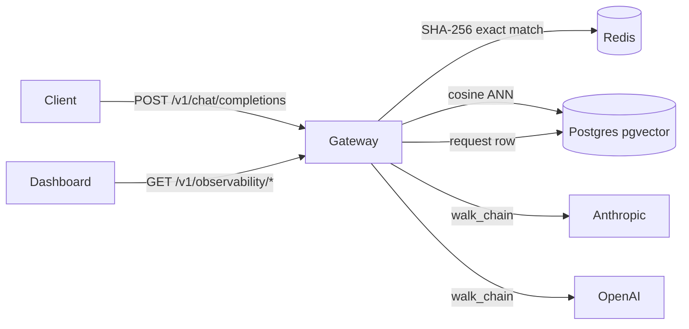

# The Conductor

The Conductor is an OpenAI-compatible transparent proxy that adds a two-layer cache, multi-provider failover, per-key budget enforcement, and a live observability dashboard to any stack already calling the OpenAI API.



---

## Quickstart

One changed line. Same SDK. Done. (Point `base_url` at your gateway — the self-host
command below brings one up on `localhost:8000`.)

```python
import openai
client = openai.OpenAI(base_url="http://localhost:8000/v1", api_key="dev-key")
print(client.chat.completions.create(model="gpt-4o-mini", messages=[{"role":"user","content":"hello"}]).choices[0].message.content)
```

---

## Architecture Decisions

These are the four decisions that shaped the design. Each one had a real alternative — the choice is the argument.

### ADR-001 — OpenAI-shape contract

**Decision:** Speak the OpenAI Chat Completions shape, not a custom API.

**Rejected:** A clean custom internal contract.

**Why:** Adoptability. Any SDK, LangChain instance, or LlamaIndex pipeline already works by changing one `base_url`. The coupling cost — a real translation layer per provider — is accepted and isolated behind a per-provider `Adapter` interface. A "universal" internal message format would be a third shape to maintain for two providers; the adapter pair is less code and the provider differences are mapped explicitly.

---

### ADR-002 — Cache after stream completion; failover only pre-first-token

**Decision:** Assemble and persist the cache entry once the stream closes. Fail over only before the first token is yielded.

**Rejected:** Mid-stream failover.

**Why:** Once the client has partial output it cannot cleanly retry elsewhere — continuing on a second provider produces a corrupt stream with a seam in the middle. The status peek in `_stream_attempt` runs inside `walk_chain` before any chunk is yielded; if the upstream returns 4xx/5xx, the chain cascades to the next candidate with no partial output sent. This constraint is honest and testable; pretending mid-stream failover is clean is not.

---

### ADR-003 — pgvector over a dedicated vector database

**Decision:** Semantic-cache vectors live in Postgres via the pgvector extension.

**Rejected:** A standalone vector database (Pinecone, Qdrant, Weaviate).

**Why:** One fewer piece of infrastructure. Postgres is already in the stack for the request log; gateway-cache scale does not need a specialized store. The HNSW cosine index in pgvector is fast enough for the access pattern (single ANN lookup per request, sub-millisecond on a warm index). Fewer moving parts beat marginal index-query performance at this scale.

---

### ADR-004 — FastAPI/Python over Go/Rust

**Decision:** Async FastAPI.

**Rejected:** Go or Rust for "infrastructure credibility."

**Why:** A clean, well-tested async implementation in the operated stack beats shaky code in a language the team does not operate. Gateway overhead is low single-digit milliseconds p50 — well within bounds for a proxy — see [Benchmark Results](#benchmark-results) for the current, reproducible figure. The hot path can be ported to Go later as a victory lap, not the build.

---

## Benchmark Results

> **Interim note:** the numbers below are from a fixed, reproducible harness
> (warmup, pinned worker/connection config, 3 trials/run, 3 independent runs
> agreeing within ~15% — see `bench/README.md`) run on a **dev laptop**, not
> the deployed reference instance. The previous numbers in this table (2.3 ms
> p50 overhead, ~730 RPS peak) came from a single un-repeated run and did not
> reproduce — an independent re-run came out 2-4x worse — so they have been
> retracted. FINAL numbers will be re-measured on the deployed Fly instance
> and will replace these.

All numbers from `bench/reports/` — run against a local mock provider on loopback, single uvicorn worker (pinned via `GATEWAY_WORKERS`). Each is the mean across 3 independent full harness runs (3 trials each); see the linked reports for per-run and per-trial spread.

| Benchmark | Result |
|---|---|
| Overhead p50 | ~3.6 ms added over direct provider call (3 runs: 3.41 / 3.44 / 3.89 ms) |
| Overhead p95 | ~8.0 ms added |
| Overhead p99 | ~12.0 ms added |
| Cache hit rate | 25.0% (50/200 exact hits under bench corpus) |
| Failover success rate | 100% (200/200 when primary returns 503) |
| Throughput peak | ~634 RPS mean (3 runs: 601 / 666 / 634 RPS), single worker, saturation at ~10 concurrent |

**Methodology:** Cache bypassed for overhead and throughput benches (`cache: {no_cache: true}`). `FALLBACK_BACKOFF_BASE_MS=0` for failover timing. Semantic cache skipped in bench run (no live `OPENAI_API_KEY`); exact-cache hit rate reflects the 50-question paraphrase corpus with identical repeats.

---

## Self-Host

```bash
OPENAI_API_KEY=sk-... ANTHROPIC_API_KEY=sk-... docker compose -f infra/docker-compose.yml up
```

Health check:

```bash
curl http://localhost:8000/health
# → {"status":"ok","db":true,"redis":true}
```

See [gateway/DEPLOY.md](gateway/DEPLOY.md) for the Fly.io runbook.

---

## Live Demo

No hosted instance is currently running. Bring one up locally with the **Self-Host**
command above, or deploy your own to Fly.io following [gateway/DEPLOY.md](gateway/DEPLOY.md).

---

## Future Work / Deliberately Out of Scope

**Mid-stream failover** — not supported by design (ADR-002). Once the client has partial output, retrying elsewhere produces a corrupt stream.

**Third provider** — adding one requires a new adapter in `translation/` but is otherwise mechanical. Excluded as scope discipline; two providers are sufficient to demonstrate the pattern.

**Semantic threshold, measured, with a known gap** — `bench/cache_bench.py --mode=similarity` sweeps thresholds 0.80–0.99 against a labeled true-duplicate / near-miss-trap / unrelated eval set. The default (0.95) is the safest single threshold found, but it does not fully meet the ≤1% false-positive target: a numeric-ID near-miss out-scores every true duplicate in the eval set, a limit no global threshold can fix. See `bench/reports/bench-20260713-similarity-threshold.md` for the sweep, root-cause analysis, and the recommended follow-up (a non-similarity guard for mismatched numeric literals/IDs).

**Dashboard authentication** — the six observability endpoints are read-only and unauthenticated. Restrict in production behind a reverse proxy (e.g., nginx `auth_basic`, Fly.io `[http_service.checks]`).

**Horizontal scale** — Redis spend counters use `INCRBYFLOAT` (atomic); asyncpg connections are per-process. Multiple workers or machines work correctly but are not load-tested.
